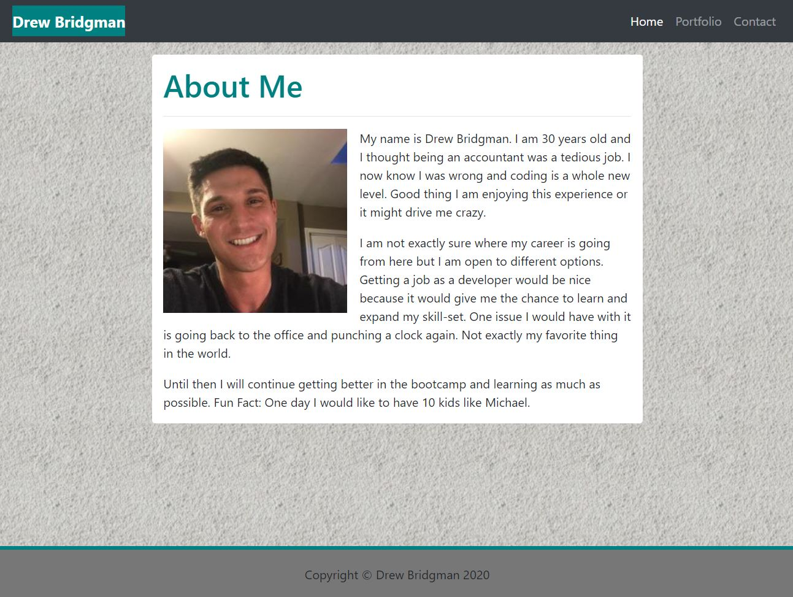

# Responsive-Portfolio

## Description

The purpose of this project is to create a web application that is responsive on a variety of devices and window or screen sizes.  When creating any web application it needs to be designed with mobile-first mindset.  Many clients require this feature because so many users are using their phones over their desktops.  This particular application with constructed with personalized information. (bio, name, etc.)

## Developer 

I received instructions to create a web application 

 

Link for application: [Bridgman Portfolio](https://dbridgman1.github.io/Responsive-Portfolio/)

## Fucntionality

